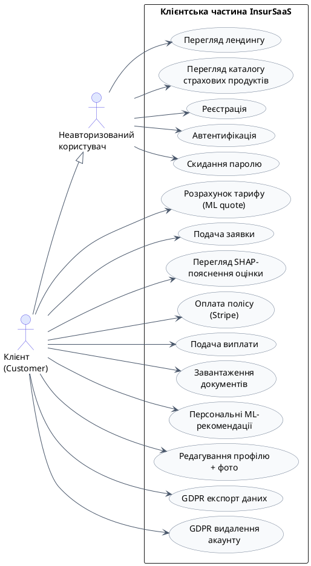
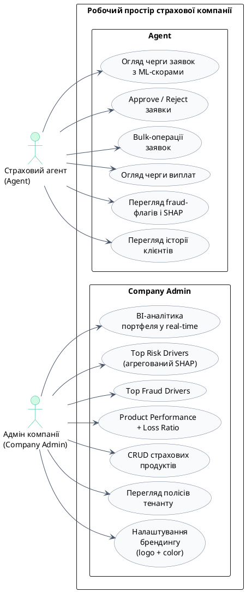
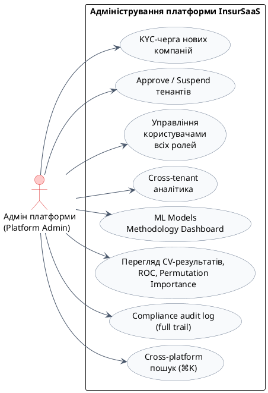
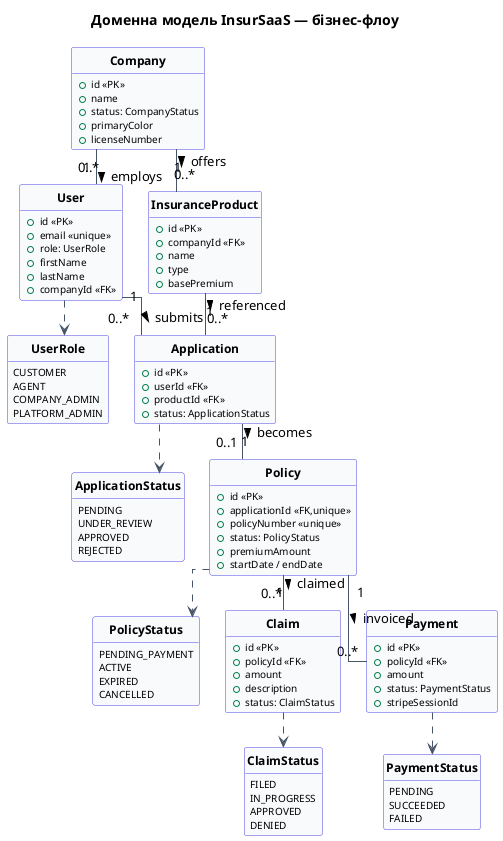
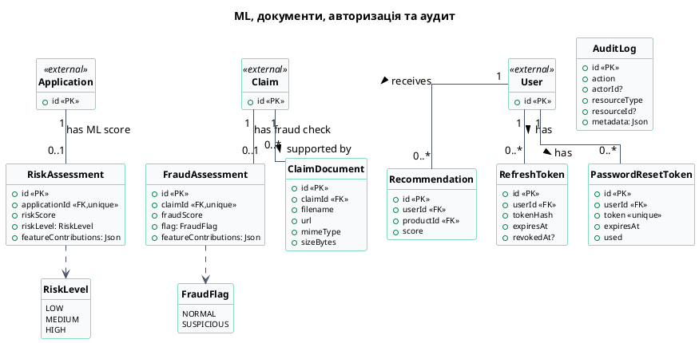
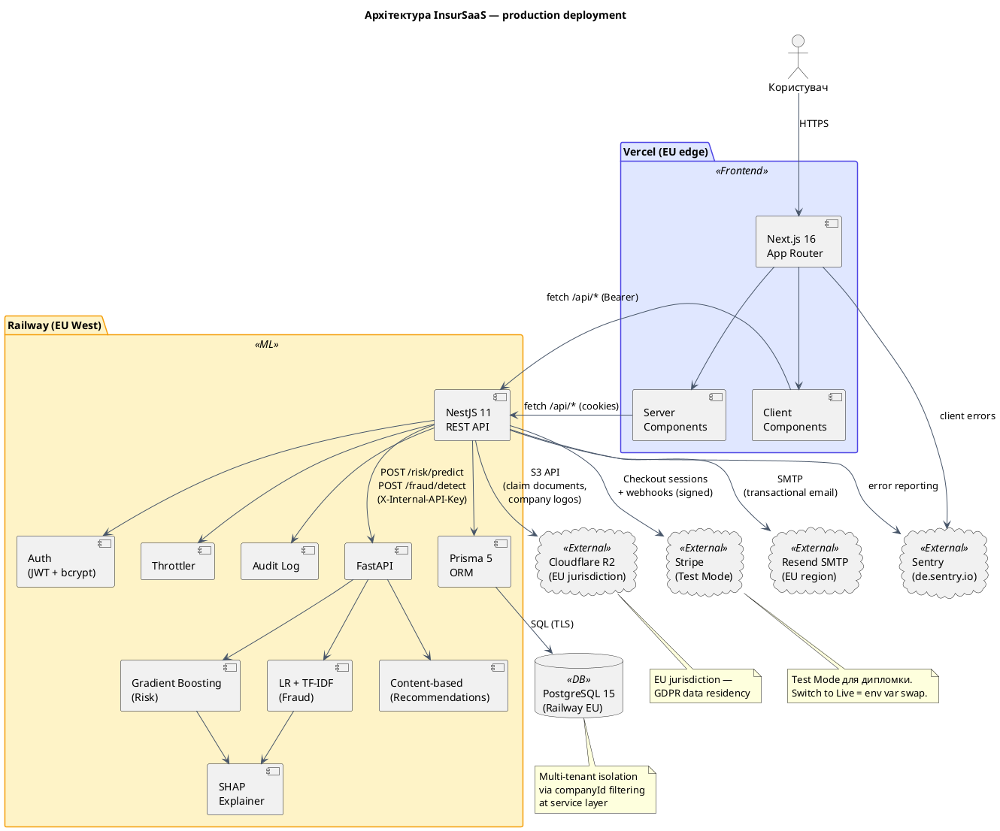
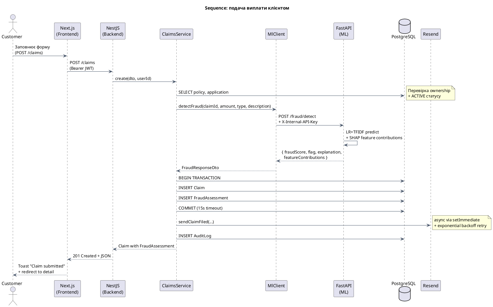

# PlantUML діаграми для презентації InsurSaaS

Кожен блок коду нижче скопіюй у [plantuml.com](https://www.plantuml.com/plantuml/uml/)
або у будь-який інший PlantUML-редактор (Mermaid plugin, Visual Studio Code
PlantUML extension). Експортуй у PNG/SVG і встав у слайди презентації.

---

## 1️⃣ Діаграми використання — РОЗБИТІ НА 3 КОМПАКТНІ

> Завелика діаграма не читається. Розбила на 3 окремих — кожна на свій слайд.
> Стиль повторює приклад з PPTX (вебзастосунок vs CRM окремо).

### 1A. Діаграма використання — клієнтська частина

Покажи на слайді **6** (замість моїх bullet-списків). Customer + Guest разом.

---

### 1B. Діаграма використання — Agent + Company Admin

Покажи на слайді **7**. Два актори страхової компанії.

---

### 1C. Діаграма використання — Platform Admin

Покажи на новому слайді (вставляється після 7). Окремо адміністратор платформи — суперюзер.

---

## 2️⃣ Діаграма класів моделей — РОЗБИТА НА 2 ЧАСТИНИ

> Одна велика діаграма з усіма 14 моделями виходить нечитабельною на слайді.
> Розбила за логічними доменами: **2A** — основний бізнес-флоу, **2B** — ML та інфраструктура.
> Скорочено до 4-6 ключових полів на клас, прибрано `createdAt` / optional fields, що в кожному класі.

---

### 2A. Бізнес-модель (Core domain)

Покажи на окремому слайді після Use Case. Це основний research artifact — продукт→заявка→поліс→виплата.

---

### 2B. ML, документи, авторизація, аудит

Покажи на окремому слайді одразу після 2A. Це «сателіти» навколо ядра — ML-оцінки, документи, токени, лог.

> Класи `Application`, `Claim`, `User` показані як «зовнішні якорі» (`<<external>>`) — їхні деталі вже на діаграмі 2A. Тут вони лише для зв'язків.

---

## 3️⃣ Архітектура системи (Component Diagram)

---

## 4️⃣ Bonus — Sequence: подача виплати з SHAP fraud check

Якщо хочеш показати конкретний flow:

---

## Як використати

1. Зайди на https://www.plantuml.com/plantuml/uml/
2. Стерти весь приклад у текстовому полі
3. Вставити один з блоків коду вище (без \`\`\`plantuml \`\`\`)
4. Згенерується картинка → завантаж як PNG або SVG
5. Встав у відповідний слайд презентації

**Або** — встанови VS Code extension "PlantUML" і генеруй прямо у редакторі.

**Або** — у GitHub README.md PlantUML рендериться через [Kroki](https://kroki.io/) або просто вставив `@startuml ... @enduml` блок як зображення через сервіс типу [plantuml-encoder](https://www.npmjs.com/package/plantuml-encoder).

---

**Поради:**
- Use case діаграма (#1) дуже широка — можеш розділити на 2 діаграми (Customer+Agent окремо від CompanyAdmin+PlatformAdmin) для презентації.
- Class diagram (#2) — основний "research artifact" для бакалаврського захисту. Покажи на окремому слайді.
- Architecture (#3) — заміни на слайд 8 у презентації.
- Sequence (#4) — бонус, опціонально для додаткового слайду після ML методології.
