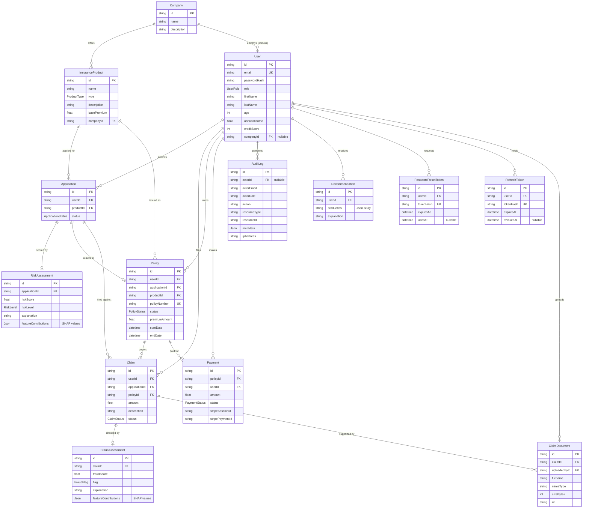

# Database Schema (ERD)

Entity-Relationship Diagram for the InsurSaaS platform. Source of truth: [`backend/prisma/schema.prisma`](backend/prisma/schema.prisma).

## Key design decisions

- **`User.companyId` is nullable** — customers, agents, and platform admins have no company; only company admins are tenant-bound.
- **`Application` 1→0..1 `RiskAssessment`** — every application that successfully calls the ML service gets exactly one risk assessment. The 0..1 covers the case where ML service is unreachable (graceful degradation).
- **`Claim` 1→0..1 `FraudAssessment`** — same pattern as risk.
- **`featureContributions` JSONB** — SHAP values stored as `[{feature, value, contribution}]` to keep the relational schema flexible if we change features.
- **Refresh tokens are hashed** — `RefreshToken.tokenHash` is bcrypt-hashed before storage so a DB leak cannot impersonate users.
- **Cascading deletes** are configured where ownership semantics require it (e.g., deleting a User cascades to their refresh tokens but NOT to their applications, which become "orphaned" historical records preserved for audit purposes).

## Tenant scoping

Multi-tenant isolation happens at the **service layer**, not in Prisma:
- `COMPANY_ADMIN.companyId` is set at registration
- Queries that should be tenant-scoped include `where: { product: { companyId: user.companyId } }`
- `PLATFORM_ADMIN` queries omit the company filter
- `CUSTOMER` and `AGENT` queries use ownership filters (`userId === user.id` for customers, no filter for agents)
